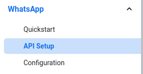
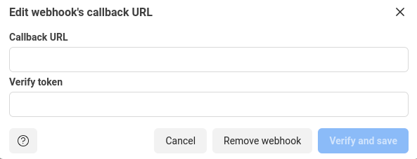

<samp>

# sarufi-heyoo-blueprint

Starter code to integrating sarufi with [heyoo](https://github.com/Neurotech-HQ/heyoo)

A blueprint for deploying sarufi chabot on WhatsApp Cloud API. In this blueprint, we shall set up a webhook to receive whatsapp messages. The are several ways you can set up a webhook. I will be using [ngrok](https://ngrok.com/) and [Replit](https://replit.com/)

## Requirements

Make sure you have [sarufi package](https://github.com/Neurotech-HQ/sarufi-python-sdk) installed on your machine before launching your whatsapp bot, you can easily install by the following command;

```bash
git clone https://github.com/Neurotech-HQ/sarufi-python-sdk
cd sarufi-python-sdk
sarufi-python-sdk $ python setup.py install
```

## YAML CONFIGURATION

Configure yaml to resemble your project details and whatsapp cloud API keys.
Navigate to *Getting started* to get whatsApp cloud `token` and `phone number ID` to be used in the configuration file.


```YAML
sarufi:
  username: sarufi_username
  password: sarufi_password
  bot_id: sarufi_bot_id

whatsapp:
  token: whatsapp_token
  phone_number_id: whatsapp_phone_number_id
```

## LAUNCH

Once you have configured your YAML file, now you are ready to launch your whatsapp bot.

```bash
python3 app.py
```

## Setting Webhook

### using ngrok

Make sure you have installed in your working machine. run

```bash
./ngrok http 5000
```

**Note:** keep the port number the same as used in `app.py`
After ruuning the command, you will have to copy the url ngrok provides. The url looks like `https://xxxxxxxxxxx.ngrok.io`

With the provided url, go to your whatsapp cloud --> `configuration` --> edit --> then paste the url into callback url.
Open `app.py`, copy the `VERIFY_TOKEN`--> paste into verify token in your whatsapp cloud --> **verify and save**

When done with saving the token and url, go on to text your bot

### using Replit

Log into your account, create a python repl. Download `main.py` from [Whatsapp bot using sarufi API and heyoo](https://github.com/jovyinny/whatsap-bot-using-sarufi-api-and-heyoo.git).

Upload/copy `main.py` code into your replit repl created.  In your repl, navigate to Tools --> packages, then install `heyoo`.
Navigate to Tools--> Secrets to create environment variables.
Create
  `phone_number_id`--> to store whatsapp cloud phone ID
  `whatsapp_token` --> Your whatsapp token
  `username` --> Your sarufi username
  `password`--> sarufi password
  `bot_id`--> Your sarufi bot id

After creating the secret keys, run your `main.py`. A small webview window will open up with a url that looks like `https://{your repl name}.{your replit usermae}.repl.co`.

Copy the url, the navigate to your whatsapp cloud account --> `configuration` --> edit --> then paste the url into callback url. Go into your repl, copy the `VERIFY_TOKEN` --> paste into verify token in your whatsapp cloud --> **verify and save**


When done with saving the token and url, go on to text your bot

## Issues

If you will face any issue, please raise one so as we can fix it as soon as possible

## Contribution

If there is something you would like to contribute, from typos to code to documentation, feel free to do so, `JUST FORK IT`.

## Credits

All the credits to

1. [kalebu](https://github.com/Kalebu/)
2. All other contributors

</samp>
